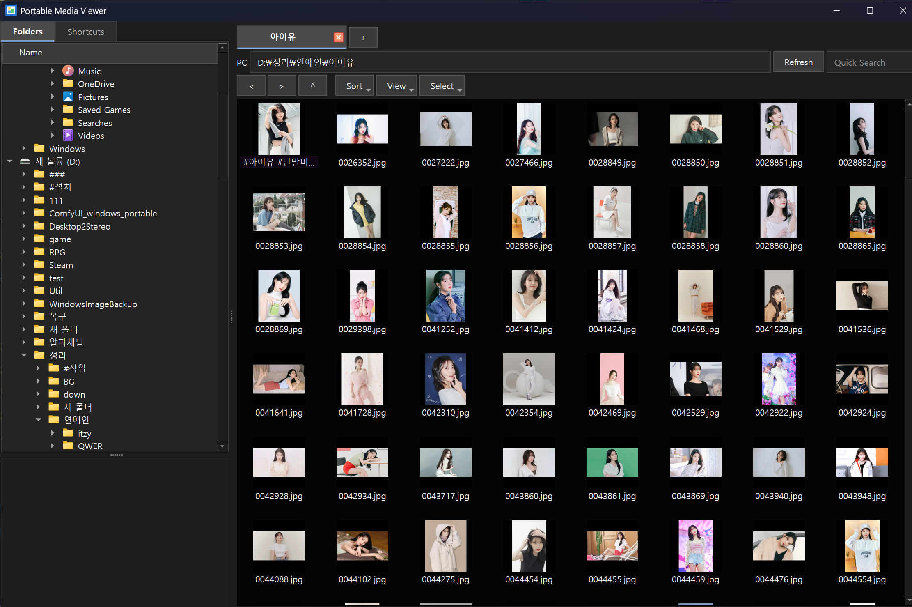

# Portable Media Viewer

> Built with assistance from OpenAI Codex.  
> OpenAI Codex의 도움을 받아 제작되었습니다.

Portable Media Viewer is a Windows portable image, animated image, video, and
archive browser. It is designed for fast folder navigation and a full-screen
viewer workflow without installing a desktop app.

Windows용 포터블 이미지, 움짤, 동영상, 압축파일 브라우저입니다. 빠른 폴더 탐색과
전체화면 뷰어 흐름을 목표로 만들었습니다.

## Screenshots / 스크린샷



Folder and thumbnail browser for quickly navigating local image collections.  
로컬 이미지 폴더를 빠르게 탐색할 수 있는 폴더 트리와 썸네일 브라우저 화면입니다.


Viewer mode with single-image, two-page comic/book, three-page, and vertical webtoon-style layouts.  
단일 사진 보기, 2분할 만화책 보기, 3분할 보기, 세로 웹툰 스크롤 보기 모드를 지원하는 이미지 보기 화면입니다.

## Download

Download the ready-to-run portable build from GitHub Releases:

https://github.com/StynerPark/Portable-image-Viewer/releases

Extract the zip file and run `PortableMediaViewer.exe`.

## Korean Guide

### 주요 기능

- Windows 폴더 트리 기반 탐색기
- 폴더 / 바로가기 / 파일 목록 패널
- 썸네일, 리스트, 디테일 보기 모드
- 이름, 크기, 종류, 수정일 기준 정렬
- 이미지, GIF, animated WebP, 동영상 파일을 섞어서 탐색 및 재생
- ZIP 파일을 폴더처럼 열어서 내부 이미지 보기
- VLC/libVLC 기반 동영상 재생
- 단일, 2분할, 3분할, 웹툰 스크롤 뷰어 모드
- 높이 맞춤, 너비 맞춤, 창 맞춤, 원본 크기, 수동 확대
- 확대 비율 잠금 및 해제
- 이미지 회전: 왼쪽 90도, 0도 초기화, 오른쪽 90도
- 탐색기/뷰어에서 복사, 붙여넣기, 삭제 지원
- 라이트 모드 / 다크 모드
- 설정값은 portable 폴더의 `settings.json`에 저장

### 실행 방식

- 프로그램을 그냥 실행하면 기본 시작 폴더에서 탐색기 모드로 열립니다.
- 이미지/GIF/WebP/동영상을 Windows 기본 앱으로 연결한 뒤 더블클릭하면 바로 뷰어 모드로 열립니다.
- 이 경우 뷰어를 닫으면 해당 파일이 있던 폴더 위치로 돌아갑니다.
- 마지막으로 열었던 폴더는 기본 실행 시 자동 복원하지 않습니다. 다른 사람이 실행했을 때 이전 사진 위치가 바로 노출되지 않게 하기 위한 동작입니다.

### 뷰어 모드

- 파일을 더블클릭하거나 `Enter`를 누르면 뷰어 모드로 들어갑니다.
- 뷰어 모드에서는 전체화면이 기본입니다.
- 빈 공간을 더블클릭하면 탐색기 모드로 돌아갑니다.
- 상단/하단 컨트롤은 마우스를 해당 영역 근처로 가져가면 잠시 표시됩니다.
- 동영상은 하단 팝업 컨트롤에서 재생/정지, 재생바 이동, 시간 표시, 볼륨 조절을 할 수 있습니다.
- GIF와 animated WebP는 큰 파일에서도 다음 파일로 넘어갈 때 멈춤이 적도록 순차 디코딩 방식으로 재생합니다.

### 기본 단축키

| 동작 | 기본 단축키 |
| --- | --- |
| 뷰어 열기 | `Enter` |
| 전체화면 전환 | `F11`, 마우스 휠 버튼 |
| 다음 파일 | 마우스 휠 아래, `PageDown` |
| 이전 파일 | 마우스 휠 위, `PageUp` |
| 첫 파일 | `Home` |
| 마지막 파일 | `End` |
| 스페이스 이동 | `Space` |
| 확대 | `+`, `Ctrl++` |
| 축소 | `-`, `Ctrl+-` |
| 높이 맞춤 | `H` |
| 너비 맞춤 | `W` |
| 원본 크기 | `1` |
| 확대 잠금 전환 | `L` |
| 오른쪽 회전 | `R` |
| 왼쪽 회전 | `Shift+R` |
| 뒤로 | `Alt+Left`, 마우스 뒤로 버튼 |
| 앞으로 | `Alt+Right`, 마우스 앞으로 버튼 |
| 이름 변경 | `F2` |
| 복사 | `Ctrl+C` |
| 붙여넣기 | `Ctrl+V` |
| 삭제 | `Delete` |
| 설정 열기 | `F1` |

`Space`는 이미지 뷰어에서는 다음 파일로 이동하며, 마지막 파일에서 누르면 처음 파일로 돌아갑니다. 동영상 재생 중에는 동영상 플레이어의 재생/일시정지 동작과 충돌할 수 있어 영상 조작을 우선합니다.

### 숨겨진 설정

설정 버튼은 기본 화면에 따로 크게 노출하지 않았습니다. `F1`을 누르면 설정 창이 열립니다.

설정 창에서 다음 항목을 바꿀 수 있습니다.

- 라이트 모드 / 다크 모드
- 각 기능별 키보드 단축키
- 마우스 입력 토큰: `MouseMiddle`, `MouseBack`, `MouseForward`, `WheelUp`, `WheelDown`
- 하나의 기능에 여러 단축키 지정 가능
- 키보드와 마우스 단축키를 동시에 지정 가능

변경된 설정은 `settings.json`에 저장됩니다. 일부 단축키 바인딩은 재시작 후 완전히 반영됩니다.

## English Guide

### Features

- Windows-style folder tree navigation
- Folder, shortcut, and file browser panes
- Thumbnail, list, and details view modes
- Sort by name, size, type, and modified date
- Mixed image, GIF, animated WebP, and video browsing
- Open ZIP archives like folders for image viewing
- VLC/libVLC video playback
- Single, double, triple, and webtoon scrolling viewer modes
- Fit height, fit width, fit window, actual size, and manual zoom
- Zoom lock/unlock
- Image rotation: left 90 degrees, reset to 0 degrees, right 90 degrees
- Copy, paste, and delete in explorer and viewer modes
- Light and dark themes
- Portable settings saved in `settings.json`

### Opening Files

- Launching the app normally opens the default start folder in explorer mode.
- If you associate image/video extensions with this app in Windows, double-clicking a media file opens directly in viewer mode.
- When leaving viewer mode, the explorer returns to the folder that contains the opened file.
- The app intentionally does not restore the last viewed folder on normal startup, so private image locations are not exposed automatically.

### Viewer Mode

- Double-click a file or press `Enter` to enter viewer mode.
- Viewer mode is full-screen by default.
- Double-click empty viewer space to return to explorer mode.
- Top and bottom controls appear briefly when the mouse is near the control areas.
- Video controls appear at the bottom: play/stop, seek bar, time display, and volume.
- GIF and animated WebP playback uses incremental frame decoding to reduce freezes when moving between files.

### Default Shortcuts

| Action | Default shortcut |
| --- | --- |
| Open viewer | `Enter` |
| Toggle fullscreen | `F11`, middle mouse button |
| Next file | mouse wheel down, `PageDown` |
| Previous file | mouse wheel up, `PageUp` |
| First file | `Home` |
| Last file | `End` |
| Space navigation | `Space` |
| Zoom in | `+`, `Ctrl++` |
| Zoom out | `-`, `Ctrl+-` |
| Fit height | `H` |
| Fit width | `W` |
| Actual size | `1` |
| Toggle zoom lock | `L` |
| Rotate right | `R` |
| Rotate left | `Shift+R` |
| Back | `Alt+Left`, mouse back button |
| Forward | `Alt+Right`, mouse forward button |
| Rename | `F2` |
| Copy | `Ctrl+C` |
| Paste | `Ctrl+V` |
| Delete | `Delete` |
| Open settings | `F1` |

In image viewer mode, `Space` moves to the next file and wraps from the last file back to the first. During video playback, video play/pause behavior may take priority.

### Hidden Settings

The settings UI is intentionally hidden from the main toolbar. Press `F1` to open it.

In settings, you can change:

- Light/dark theme
- Keyboard shortcuts per action
- Mouse shortcut tokens: `MouseMiddle`, `MouseBack`, `MouseForward`, `WheelUp`, `WheelDown`
- Multiple shortcuts for the same action
- Keyboard and mouse shortcuts at the same time

Settings are saved in `settings.json`. Some shortcut binding changes require restarting the app.

## Run From Source

Install dependencies:

```powershell
python -m pip install -r requirements.txt
```

Run:

```powershell
python main.py
```

For video playback, place a VLC/libVLC runtime folder named `vlc` next to
`main.py`. The VLC runtime is intentionally not committed to this repository.

Runtime settings are created as `settings.json` on first use. See
`settings.example.json` for the default structure.

## Build

```powershell
python build_exe.py
```

The build output is created under `dist/PortableMediaViewer`.

## Repository And Releases

Source code is published in this repository. Ready-to-run portable builds are
attached to GitHub Releases.
